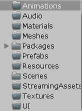

# Throwing
&lt;短兵相投>游戏仓库


 

```
Animations 放动画相关的东西
Audio 放音频相关的东西
Materials 放材质
Meshes 放网格体, 包括静态模型和动态骨架(相关的材质和贴图和动画建文件夹来放在一起)
Packages 放各种插件或者是资源包
Resources 内置的一个定名文件夹, 用来存放打包时会进入assetbundle的资源
Scenes 放场景, 测试自己内容的时候务必记得新建场景
StreamingAssets 同样内置的一个定名文件夹, 用来放不会进入assetbundle的资源
Textures 放一些杂七杂八的贴图
UI ui相关的贴图
```

